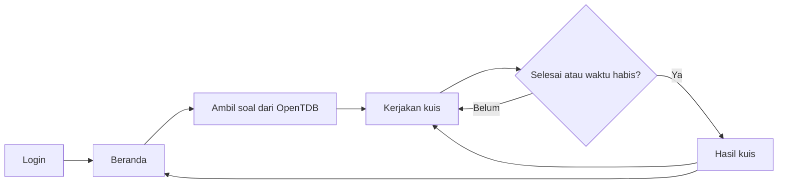

# Open Trivia Quiz

Aplikasi kuis berbasis web yang dibuat menggunakan React dan Open Trivia DB. Pengguna dapat masuk melalui form login sederhana, membuka halaman beranda, mengerjakan kuis satu soal per halaman, melihat timer pengerjaan, dan memperoleh ringkasan hasil di akhir kuis.

Project ini menggunakan kategori **Science: Computers** dengan 10 soal yang diambil dari API publik [Open Trivia Database](https://opentdb.com/).

## Daftar Isi

- [Fitur](#fitur)
- [Alur Aplikasi](#alur-aplikasi)
- [Teknologi](#teknologi)
- [Prasyarat](#prasyarat)
- [Instalasi](#instalasi)
- [Menjalankan Project](#menjalankan-project)
- [Route Aplikasi](#route-aplikasi)
- [Struktur Project](#struktur-project)
- [Arsitektur dan Pengelolaan Data](#arsitektur-dan-pengelolaan-data)
- [Konfigurasi API](#konfigurasi-api)
- [Konfigurasi Styling dan UI](#konfigurasi-styling-dan-ui)
- [Path Alias](#path-alias)
- [Validasi Login](#validasi-login)
- [Build dan Deployment](#build-dan-deployment)
- [Troubleshooting](#troubleshooting)
- [Batasan Saat Ini](#batasan-saat-ini)
- [Kontribusi](#kontribusi)
- [Referensi](#referensi)
- [Lisensi](#lisensi)

## Fitur

- Form login dengan validasi email dan password.
- Tombol untuk menampilkan atau menyembunyikan password.
- Halaman beranda sebagai titik awal kuis.
- Pengambilan 10 soal dari Open Trivia DB.
- Kategori soal `Science: Computers`.
- Mendukung soal pilihan ganda dan benar/salah.
- Pengacakan posisi jawaban pada setiap soal.
- Dekode HTML entity dari respons API, misalnya `&quot;`.
- Satu halaman hanya menampilkan satu soal.
- Otomatis berpindah ke soal berikutnya setelah jawaban dipilih.
- Menampilkan total soal dan jumlah soal yang sudah dijawab.
- Timer kuis selama 3 menit.
- Kuis otomatis berakhir ketika semua soal selesai atau waktu habis.
- Ringkasan hasil berupa jumlah jawaban benar, salah, dan terjawab.
- Tombol untuk mengulangi kuis tanpa mengambil ulang soal.
- Penanganan loading dan error ketika API tidak dapat diakses.
- Halaman fallback untuk route yang tidak ditemukan.

## Alur Aplikasi



Urutan penggunaan:

1. Pengguna membuka aplikasi dan diarahkan ke `/login`.
2. Pengguna mengisi email dan password yang valid.
3. Setelah login, pengguna diarahkan ke `/beranda`.
4. Tombol **Mulai Kuis** membuka `/quiz`.
5. Aplikasi mengambil soal dari Open Trivia DB.
6. Pengguna memilih satu jawaban untuk setiap soal.
7. Setelah semua soal selesai atau timer habis, aplikasi menampilkan hasil.

## Teknologi

| Bagian | Teknologi |
| --- | --- |
| Framework UI | React 19 |
| Build tool | Vite 8 |
| Bahasa | JavaScript dan JSX |
| Routing | React Router 7 |
| Styling | Tailwind CSS 4 |
| Komponen UI | shadcn/ui |
| Primitive UI | Radix UI dan Base UI |
| Icon | Lucide React |
| Font | Geist Variable |
| Linting | ESLint 10 |
| API soal | Open Trivia DB |
| Package manager | npm |

Project juga mengaktifkan React Compiler melalui konfigurasi Vite.

## Prasyarat

Pastikan perangkat sudah memiliki:

- [Git](https://git-scm.com/)
- [Node.js](https://nodejs.org/) versi `20.19+` atau `22.12+`
- npm, yang tersedia bersama instalasi Node.js
- Browser modern
- Koneksi internet untuk mengambil soal dari Open Trivia DB

Persyaratan versi Node.js mengikuti kebutuhan Vite 8.

Periksa versi yang terpasang:

```bash
node --version
npm --version
git --version
```

## Instalasi

Clone repository:

```bash
git clone https://github.com/NamkuGavin/aplikasi-kuis-challangeDOT.git
```

Masuk ke folder project:

```bash
cd aplikasi-kuis-challangeDOT
```

Pasang dependency berdasarkan `package-lock.json`:

```bash
npm ci
```

Jika `npm ci` tidak dapat digunakan karena lock file sedang diperbarui, gunakan:

```bash
npm install
```

Project ini tidak membutuhkan file `.env` untuk konfigurasi saat ini karena URL Open Trivia DB masih didefinisikan langsung di service.

## Menjalankan Project

### Development server

```bash
npm run dev
```

Secara default, Vite menyediakan aplikasi melalui:

```text
http://localhost:5173
```

Gunakan alamat yang ditampilkan terminal jika port tersebut sedang dipakai aplikasi lain.

### Lint

```bash
npm run lint
```

> Kondisi saat ini: lint seluruh repository belum bersih. Error terutama berasal dari source komponen generated shadcn/ui, aturan Fast Refresh, import React yang dianggap tidak digunakan, dan aturan `set-state-in-effect`. Production build tetap berhasil. Perbaikan lint sebaiknya dilakukan melalui penyesuaian aturan ESLint yang terarah, bukan dengan mengubah seluruh komponen UI secara massal.

### Production build

```bash
npm run build
```

Hasil build akan dibuat di folder `dist/`.

### Preview production build

Jalankan build terlebih dahulu, lalu:

```bash
npm run preview
```

## Route Aplikasi

| Route | Keterangan |
| --- | --- |
| `/` | Mengarahkan pengguna ke `/login` |
| `/login` | Form login |
| `/beranda` | Halaman utama dan tombol mulai kuis |
| `/quiz` | Halaman pengerjaan dan hasil kuis |
| `*` | Halaman 404 untuk route yang tidak tersedia |

Route `/beranda` dan `/quiz` menggunakan layout bersama dari `BuildHeader`.

> Saat ini route belum dilindungi oleh autentikasi. Pengguna masih dapat membuka `/beranda` atau `/quiz` secara langsung.

## Struktur Project

```text
aplikasi-kuis-challange-dot/
├── public/
│   ├── favicon.svg
│   └── icons.svg
├── src/
│   ├── assets/
│   │   ├── hero.png
│   │   ├── react.svg
│   │   └── vite.svg
│   ├── common/
│   │   └── utils/
│   │       └── helper.jsx
│   ├── components/
│   │   ├── ui/
│   │   │   └── ... komponen shadcn/ui
│   │   └── build_header.jsx
│   ├── hooks/
│   │   └── use-mobile.js
│   ├── lib/
│   │   └── utils.js
│   ├── modules/
│   │   ├── (auth)/
│   │   │   └── login/
│   │   │       ├── components/
│   │   │       │   └── login_form.jsx
│   │   │       └── login_view.jsx
│   │   ├── (beranda)/
│   │   │   ├── home/
│   │   │   │   └── home_view.jsx
│   │   │   └── quiz/
│   │   │       ├── components/
│   │   │       │   ├── build_error.jsx
│   │   │       │   └── build_finish_quiz.jsx
│   │   │       └── quiz_view.jsx
│   │   └── not_found/
│   │       └── 404_not_found.jsx
│   ├── services/
│   │   └── quiz_service.js
│   ├── App.jsx
│   ├── index.css
│   └── main.jsx
├── components.json
├── eslint.config.js
├── index.html
├── jsconfig.json
├── package-lock.json
├── package.json
└── vite.config.js
```

### Tanggung jawab folder

- `src/modules`: halaman dan fitur yang dikelompokkan berdasarkan domain.
- `src/components`: komponen layout dan komponen UI yang dapat digunakan kembali.
- `src/components/ui`: source code komponen shadcn/ui.
- `src/services`: komunikasi dengan API eksternal dan normalisasi respons.
- `src/common/utils`: helper umum, seperti validasi form dan format timer.
- `src/lib`: utility internal shadcn/ui, termasuk fungsi `cn()`.
- `src/hooks`: custom React hooks.
- `public`: aset statis yang disajikan langsung oleh Vite.

Nama folder `(auth)` dan `(beranda)` hanya digunakan untuk pengelompokan source code. Folder tersebut tidak otomatis membuat route group seperti pada framework lain.

## Arsitektur dan Pengelolaan Data

### Entry point

`src/main.jsx` bertanggung jawab untuk:

- melakukan render React ke elemen `#root`;
- mengaktifkan `StrictMode`;
- memasang `BrowserRouter`;
- memuat CSS global.

### Routing

Seluruh deklarasi route berada di `src/App.jsx`.

### State kuis

State kuis dikelola secara lokal di `quiz_view.jsx` menggunakan:

- `useState` untuk soal, indeks aktif, skor, timer, status, dan error;
- `useEffect` untuk mengambil soal dan menjalankan timer;
- `useRef` untuk deadline timer dan penguncian jawaban.

Status utama kuis:

- `loading`: soal sedang dimuat;
- `playing`: kuis sedang berlangsung;
- `error`: soal gagal dimuat;
- `finished`: kuis selesai atau timer habis.

### Service API

`src/services/quiz_service.js` bertanggung jawab untuk:

- mengirim request ke Open Trivia DB;
- memeriksa status HTTP dan `response_code`;
- menerjemahkan HTML entity;
- menggabungkan jawaban benar dan salah;
- mengacak posisi jawaban;
- mengubah respons API menjadi format yang digunakan UI;
- mencegah request identik yang sedang berjalan dipanggil dua kali.

Komponen UI tidak melakukan normalisasi respons API secara langsung.

## Konfigurasi API

Endpoint yang digunakan:

```text
https://opentdb.com/api.php?amount=10&category=18
```

Parameter:

| Parameter | Nilai | Fungsi |
| --- | --- | --- |
| `amount` | `10` | Mengambil 10 soal |
| `category` | `18` | Kategori Science: Computers |

Contoh struktur respons:

```json
{
  "response_code": 0,
  "results": [
    {
      "type": "multiple",
      "difficulty": "easy",
      "category": "Science: Computers",
      "question": "What does SSD stand for?",
      "correct_answer": "Solid State Drive",
      "incorrect_answers": [
        "Solution Source Disk",
        "Solid State Disk",
        "Source Solution Drive"
      ]
    }
  ]
}
```

Open Trivia DB membatasi satu kategori per request dan maksimal 50 soal per request. API publik juga dapat membatasi request yang dilakukan terlalu cepat. Hindari memanggil endpoint berulang kali dalam waktu singkat.

Untuk mengubah jumlah atau kategori soal, edit:

```js
const QUIZ_API_URL = "https://opentdb.com/api.php?amount=10&category=18";
```

di `src/services/quiz_service.js`.

Daftar kategori dan generator URL tersedia di [Open Trivia DB API Config](https://opentdb.com/api_config.php).

## Konfigurasi Styling dan UI

### Tailwind CSS

Tailwind CSS 4 dipasang sebagai plugin Vite melalui `@tailwindcss/vite` di `vite.config.js`.

CSS global berada di:

```text
src/index.css
```

File tersebut memuat:

```css
@import "tailwindcss";
@import "tw-animate-css";
@import "shadcn/tailwind.css";
@import "@fontsource-variable/geist";
```

Project Tailwind v4 ini tidak menggunakan `tailwind.config.js`.

### shadcn/ui

Konfigurasi shadcn/ui berada di `components.json` dengan ketentuan utama:

- style `radix-nova`;
- JavaScript, bukan TypeScript;
- CSS variables aktif;
- icon library Lucide;
- komponen berada di `src/components/ui`;
- utility class berada di `src/lib/utils.js`.

Gunakan komponen yang sudah tersedia sebelum menambahkan komponen baru.

### Utility `cn()`

Utility penggabungan class tersedia di:

```text
src/lib/utils.js
```

Utility tersebut menggabungkan `clsx` dan `tailwind-merge`.

Contoh:

```jsx
import { cn } from "@/lib/utils";

function Example({ className }) {
  return <div className={cn("rounded-lg p-4", className)}>Content</div>;
}
```

## Path Alias

Alias berikut sudah dikonfigurasi:

```text
@/* → src/*
```

Konfigurasi alias tersedia pada:

- `vite.config.js` untuk proses build;
- `jsconfig.json` untuk editor dan JavaScript tooling;
- `components.json` untuk shadcn/ui.

Contoh import:

```jsx
import { Button } from "@/components/ui/button";
import { getQuizQuestions } from "@/services/quiz_service";
```

Jangan mengubah alias hanya pada satu file konfigurasi karena konfigurasi build, editor, dan shadcn/ui harus tetap konsisten.

## Validasi Login

Login saat ini merupakan simulasi sisi klien. Tidak ada request ke backend, token, session, database pengguna, atau penyimpanan kredensial.

Ketentuan validasi:

- email wajib diisi;
- email harus memiliki format yang valid;
- password wajib diisi;
- password minimal 6 karakter.

Jika validasi berhasil, pengguna langsung diarahkan ke `/beranda`.

> Jangan gunakan implementasi login saat ini sebagai autentikasi production. Autentikasi production membutuhkan backend, transport HTTPS, pengelolaan session atau token yang aman, dan route protection.

## Build dan Deployment

Buat production build:

```bash
npm run build
```

Preview hasil build:

```bash
npm run preview
```

Folder `dist/` dapat di-deploy ke layanan static hosting seperti:

- Vercel
- Netlify
- Cloudflare Pages
- GitHub Pages, dengan konfigurasi `base` Vite dan fallback route tambahan

Karena aplikasi menggunakan `BrowserRouter`, hosting harus mengarahkan request route seperti `/login`, `/beranda`, dan `/quiz` kembali ke `index.html`. Tanpa SPA fallback/rewrite, refresh langsung pada route tersebut dapat menghasilkan 404 dari server hosting.

Pastikan deployment mengizinkan request HTTPS ke:

```text
https://opentdb.com
```

## Troubleshooting

### `npm` tidak dapat dijalankan di PowerShell

Jika Windows PowerShell memblokir `npm.ps1`, jalankan versi command:

```powershell
npm.cmd ci
npm.cmd run dev
```

Atau gunakan terminal Command Prompt.

### Soal gagal dimuat

Periksa:

- koneksi internet;
- status Open Trivia DB;
- error pada browser DevTools;
- apakah request dilakukan terlalu cepat;
- apakah endpoint di `quiz_service.js` masih valid.

Gunakan tombol **Coba Lagi** setelah menunggu beberapa saat.

### Port `5173` sedang digunakan

Vite biasanya memilih port lain secara otomatis. Untuk menentukan port:

```bash
npm run dev -- --port 3000
```

### Route menghasilkan 404 setelah deployment

Aktifkan SPA fallback atau rewrite seluruh route aplikasi ke `/index.html`.

### Tampilan tidak mengikuti style

Pastikan:

- `src/index.css` masih di-import oleh `src/main.jsx`;
- plugin `@tailwindcss/vite` masih terdaftar di `vite.config.js`;
- alias `@` tidak berubah;
- dependency sudah dipasang dengan benar.

## Batasan Saat Ini

- Login belum terhubung ke backend.
- Route beranda dan kuis belum dilindungi autentikasi.
- Data login dan hasil kuis tidak disimpan.
- Refresh halaman akan mereset state kuis.
- Belum tersedia riwayat pengerjaan.
- Belum tersedia pemilihan kategori, jumlah soal, atau tingkat kesulitan dari UI.
- Belum tersedia automated test.
- Soal bergantung pada ketersediaan layanan Open Trivia DB.
- Lint seluruh repository belum bersih karena konfigurasi ESLint dan source generated shadcn/ui belum sepenuhnya selaras.

## Kontribusi

Kontribusi dapat dilakukan melalui fork dan pull request.

1. Fork repository.
2. Buat branch fitur:

   ```bash
   git checkout -b feature/nama-fitur
   ```

3. Lakukan perubahan dengan tetap mengikuti struktur project.
4. Jalankan pemeriksaan:

   ```bash
   npm run lint
   npm run build
   ```

   Perhatikan catatan kondisi lint pada bagian [Menjalankan Project](#menjalankan-project). Pastikan perubahan baru tidak menambah error di luar baseline yang sudah diketahui.

5. Commit perubahan:

   ```bash
   git commit -m "feat: tambahkan nama fitur"
   ```

6. Push branch:

   ```bash
   git push origin feature/nama-fitur
   ```

7. Buka pull request.

Saat berkontribusi:

- gunakan JavaScript dan JSX;
- gunakan npm dan pertahankan `package-lock.json`;
- gunakan alias `@/` untuk import dari `src`;
- letakkan komunikasi API di folder `src/services`;
- gunakan komponen yang sudah tersedia di `src/components/ui`;
- jangan menjalankan ulang inisialisasi Tailwind atau shadcn/ui tanpa kebutuhan yang jelas;
- jangan mengubah `components.json`, alias, atau theme global tanpa menjelaskan dampaknya;
- jangan mengubah source komponen shadcn/ui jika kebutuhan dapat diselesaikan melalui props atau `className`.

## Referensi

- [React Documentation](https://react.dev/)
- [Vite Documentation](https://vite.dev/guide/)
- [React Router Documentation](https://reactrouter.com/)
- [Tailwind CSS with Vite](https://tailwindcss.com/docs/installation/using-vite)
- [shadcn/ui for Vite](https://ui.shadcn.com/docs/installation/vite)
- [Lucide React](https://lucide.dev/guide/packages/lucide-react)
- [Open Trivia DB](https://opentdb.com/)
- [Open Trivia DB API Config](https://opentdb.com/api_config.php)

## Lisensi

Repository ini belum menyertakan file `LICENSE`. Secara default, source code tidak otomatis dapat digunakan, dimodifikasi, atau didistribusikan ulang tanpa izin pemilik repository.

Jika project akan dibuka untuk kontribusi dan penggunaan publik, tambahkan file lisensi yang sesuai, misalnya MIT License.
